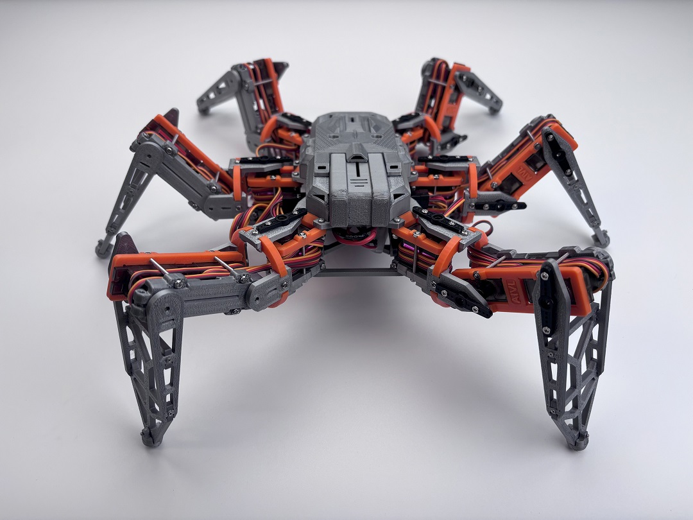

# NodeHexa - Enhanced

<div align="center">



**基于 ESP32 的六足机器人项目增强版 — 集成 Xbox 蓝牙手柄、OpenMV 视觉模块与 PyQt5 桌面控制应用**

[](https://www.espressif.com/en/products/socs/esp32)
[](https://www.arduino.cc/)
[](LICENSE)
[](https://isocpp.org/)

</div>

---

## 增强功能概览

NodeHexa-Enhanced 在原始 NodeHexa 六足机器人项目基础上，新增三大增强模块：

| 模块 | 说明 | 详细文档 |
|---|---|---|
| **Xbox 蓝牙手柄** | BLE 无线控制，摇杆/扳机/按钮全映射 | [XBOX_GAMEPAD_DEVELOPMENT.md](XBOX_GAMEPAD_DEVELOPMENT.md) |
| **OpenMV 视觉模块** | 实时图像采集，WiFi 图传至桌面应用 | [CHANGELOG_OPENMV_INTEGRATION.md](CHANGELOG_OPENMV_INTEGRATION.md) |
| **桌面控制应用** | PyQt5 GUI，实时画面显示 + 键鼠操控 | [DESKTOP_CONTROL_SOFTWARE.md](DESKTOP_CONTROL_SOFTWARE.md) |

---

## 1. Xbox 蓝牙手柄控制

通过 BLE 蓝牙连接 Xbox Series X|S 手柄，实现对机器人的无线操控。

### 已实现功能

- **蓝牙连接** — 自动配对与断线重连
- **摇杆控制** — 左摇杆转向，右摇杆前后/左右移动
- **扳机调速** — RT 按下 = 极速模式，松开 = 中速；RB 切换慢速模式
- **死区过滤** — 阈值 10000，回中自动停步
- **轴值归一化** — 16 位无符号整数 (0~65535) 转换为有符号 (-32768~32767)

### 开发计划

- [ ] Web 界面蓝牙开关
- [ ] 单腿控制模式（LT 按下启动，LB 切换控制腿）
- [ ] 镜像模式（左右腿对称映射）

> 详见 [XBOX_GAMEPAD_DEVELOPMENT.md](XBOX_GAMEPAD_DEVELOPMENT.md)

---

## 2. OpenMV 视觉模块

OpenMV Cam H7 Plus 通过 UART 将实时图像传输至 ESP32，再经 WiFi 推送到桌面应用。

### 物理接线

| OpenMV Cam H7 Plus | NodeMCU ESP32 | 说明 |
|---|---|---|
| **P4** (UART3 TX) | **GPIO33** | 图像数据传输 |
| **P5** (UART3 RX) | **GPIO32** | 双向通讯（预留） |
| **GND** | **GND** | 必须共地 |

### 技术参数

| 参数 | 值 |
|---|---|
| 分辨率 | QQVGA 160×120 |
| 压缩格式 | JPEG (quality=50) |
| 单帧大小 | ~1.8 KB |
| 帧率 | ~6 FPS |
| 波特率 | 115200 |

### 帧协议

```
[0xFF 0xAA] [4字节长度(LE)] [JPEG数据] [0xFF 0xBB]
```

### ESP32 串口资源分配

| 串口 | 引脚 | 用途 |
|---|---|---|
| Serial (UART0) | USB | 调试输出 |
| Serial1 (UART1) | GPIO33(RX), GPIO32(TX) | OpenMV 摄像头通讯 |
| Serial2 (UART2) | GPIO16(RX), GPIO17(TX) | 运动指令 |

> 详见 [CHANGELOG_OPENMV_INTEGRATION.md](CHANGELOG_OPENMV_INTEGRATION.md)

---

## 3. 桌面控制应用

基于 PyQt5 的跨平台桌面控制软件，替代/增强 Web 控制界面。

### 主要特性

- **实时图像显示** — 接收 ESP32 WebSocket 推送的 JPEG 帧并解码显示
- **悬浮 UI** — FPS、姿态角度、电池电量等信息的半透明悬浮层
- **键盘操控** — WASD 移动、QE 转向
- **鼠标云台** — 鼠标控制摄像头云台角度，带准星瞄准线
- **自动重连** — 断线后自动检测并恢复连接
- **窗口自适应** — 图像自动缩放铺满窗口

### 依赖安装

```bash
pip install PyQt5 websockets
```

### 使用方法

1. 电脑连接 `NodeHexa-7000` WiFi 热点
2. 运行 `python main.py`

> 详见 [DESKTOP_CONTROL_SOFTWARE.md](DESKTOP_CONTROL_SOFTWARE.md)

---

## 项目结构

```
NodeHexa-2.1.0/
├── firmware/                    # ESP32 固件
│   ├── src/main.cpp            # 主程序（含 OpenMVReceiveTask）
│   ├── lib/hal/pwm.cpp         # PCA9685 舵机驱动（Lazy init）
│   └── platformio.ini          # PlatformIO 配置
├── openmv_firmware/             # OpenMV 脚本
│   ├── image_sender.py         # 图像采集 + 帧协议发送
│   └── simple_test.py          # UART 通讯测试
├── desktop_app_python/          # 桌面控制应用
│   ├── main.py                 # PyQt5 主程序
│   ├── serial_monitor.py       # 串口监控工具
│   └── requirements.txt        # Python 依赖
├── CHANGELOG_OPENMV_INTEGRATION.md   # OpenMV 集成更新日志
├── XBOX_GAMEPAD_DEVELOPMENT.md       # Xbox 手柄开发文档
└── DESKTOP_CONTROL_SOFTWARE.md       # 桌面控制软件文档
```

---

## Web 控制界面

项目同时保留原有的 Web 控制功能：

- **主控制页面** — 运动控制、姿态控制、表演模式、电量监控
- **校准页面** — 实时舵机角度微调与参数保存
- **运动规划页面** — 动作序列编排与一键执行

连接 `NodeHexa` WiFi 后访问 `http://192.168.4.1` 即可使用。

---

## 快速开始

1. 使用 PlatformIO (VSCode) 编译并烧录 `firmware/` 到 ESP32
2. 机器人开机后连接 WiFi 热点 `NodeHexa` (密码: `roboticscv666`)
3. 访问 `http://192.168.4.1` 进行舵机校准
4. （可选）Xbox 手柄按配对键，自动连接
5. （可选）OpenMV 运行 `image_sender.py`
6. （可选）电脑连接 WiFi 后运行 `desktop_app_python/main.py`

---

## 致谢

- 基于 [hexapod-v2-7697](https://github.com/SmallpTsai/hexapod-v2-7697) 二次开发
- 参考 [PiHexa18](https://github.com/ViolinLee/PiHexa18) 项目设计
- Xbox 手柄库 [XboxSeriesXControllerESP32](https://github.com/asukiaaa/ESP32_connect_XboxController)

---

<div align="center">

**如果这个项目对你有帮助，请给它一个星标！**

Made with ❤️ by [ViolinLee](https://github.com/ViolinLee)

Copyright © 2024 ViolinLee. Licensed under GPL-3.0.

</div>